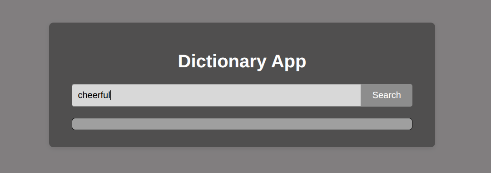

# 📖 Dictionary App

A simple and interactive Dictionary App that allows users to search for any word and view its **meanings, parts of speech, examples, synonyms, and antonyms**. Powered by the free [Dictionary API](https://dictionaryapi.dev/), the app provides well-structured definitions in a clean and readable format.

---

## 🚀 Features

- 🔍 **Word Search** — Enter any word to instantly get its definitions.
- 📝 **Detailed Word Information**:
  - Definitions
  - Parts of Speech (noun, verb, adjective, etc.)
  - Example Sentences *(if available)*
  - Synonyms & Antonyms *(if available)*
- 🧾 **Multiple Usages** — Displays different usages of a word (e.g., noun vs. verb).
- ⚠️ **Error Handling** — Shows a friendly message if the word is not found or the API request fails.
- 🎨 **Clean UI** for an easy reading experience.

---

## 🛠️ Tech Stack

- **HTML5**
- **CSS3**
- **JavaScript (ES6+)**
- **[Dictionary API](https://dictionaryapi.dev/)**

---

## 📂 Project Structure

```
📁 dictionary-app/
├── index.html               ← Main HTML file (entry point)
├── style.css                ← Styling for the app
├── script.js                ← JavaScript logic & API calls
├── README.md                ← Project documentation
└── 📁 screenshots/          ← Folder containing images used in README
    ├── search-word.png
    ├── word-meanings.png
    ├── synonyms-antonyms.png
    └── full-app-overview.png
```
---

## 📸 Screenshots

### 🔍 Word Search


### 📝 Word Meanings


### 🔄 Synonyms & Antonyms


### 🖼 Full App Overview


---

## 📦 Installation & Usage

1. **Clone the repository**:
   ```bash
   git clone https://github.com/shatrughanshukla/dictionary-app.git
   cd dictionary-app


🌐 API Reference

- **[Dictionary API](https://dictionaryapi.dev/)**

📖 A simple Dictionary App that fetches word meanings, definitions, synonyms, antonyms, and examples using the Dictionary API.

